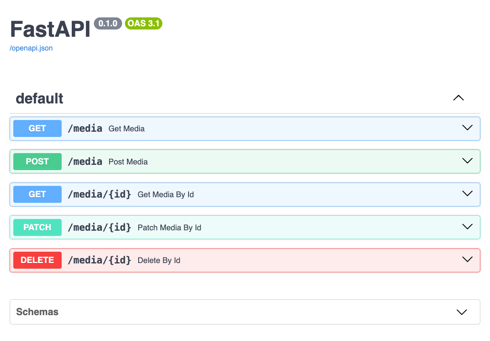
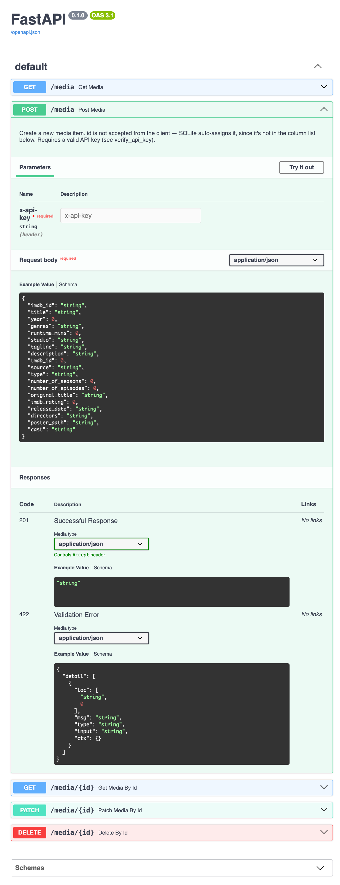

# Media Library API

A FastAPI REST API for browsing and managing a personal movie/TV library, built on top of the SQLite database from [Project 7 (Media Library Browser)](https://zoltanlederer.com/blog/proj-07-media-library-browser.html). Wraps ~3,500 titles pulled from Plex, IMDB, and TMDB with full CRUD support, filtering, validation, and API key–protected write access.

**Live demo / Interactive docs (Swagger):** https://media-library-api-i5uo.onrender.com/docs

> ⚠️ The live demo runs on Render's free tier. It spins down after 15 minutes of inactivity — the first request after a period of idle time can take 30–60 seconds to respond. It also uses a small 17-title sample database (`media.example.db`), not the full personal library.

---

## Features

- **`GET /media`** — list all items, with optional filters: `title`, `genre`, `year`, `actor`, `media_type` (combined with AND)
- **`GET /media/{id}`** — fetch a single item by id
- **`POST /media`** — create a new item
- **`PATCH /media/{id}`** — partially update an item (only sends the fields you want to change)
- **`DELETE /media/{id}`** — delete an item
- Full Pydantic validation on every request and response
- Write endpoints (`POST`, `PATCH`, `DELETE`) require an API key; reads are fully public
- Auto-generated interactive documentation via Swagger (`/docs`)

## Tech stack

- **FastAPI** — web framework
- **Pydantic** — data validation
- **SQLite** — database
- **Uvicorn** — ASGI server
- **python-dotenv** — environment variable management
- **Render** — deployment

## Screenshots

**All endpoints, via Swagger:**



**`POST /media` expanded — required API key header, request body schema, and response codes:**



---

## Project structure

```
media-library-api/
├── main.py                  ← FastAPI app, all routes, Pydantic models
├── data/
│   ├── media.db              ← real library (gitignored, not on GitHub)
│   └── media.example.db      ← small sample db, included in this repo
├── migrations/                ← one-off scripts documenting schema changes
├── scripts/                   ← utility scripts (e.g. null-count checks, example db creation)
├── .env.example                ← template for required environment variables
├── requirements.txt
└── README.md
```

---

## Running it locally

1. Clone the repo and enter the project folder:
   ```bash
   git clone https://github.com/zoltanlederer/media-library-api.git
   cd media-library-api
   ```

2. Create and activate a virtual environment:  
   Mac/Linux
    ```bash
    python3 -m venv .venv
    source .venv/bin/activate
    ```

    Windows
    ```bash
    python3 -m venv .venv
    .venv\Scripts\activate
    ```

3. Install dependencies:
   ```bash
   pip install -r requirements.txt
   ```

4. Create a `.env` file in the project root (see `.env.example`):
   ```
   API_KEY=choose-any-value-you-like
   DB_PATH=./data/media.example.db
   ```
   There's no default for either variable — both must be set, or the app won't start correctly. Use `media.example.db` (included in this repo) unless you have your own `media.db`.

5. Start the server:
   ```bash
   uvicorn main:app --reload
   ```

6. Visit `http://127.0.0.1:8000/docs` for the interactive API docs.

## Using the write endpoints

`POST`, `PATCH`, and `DELETE` require an `X-API-Key` header matching your `API_KEY` environment variable. `GET` endpoints need no key.

For the **live demo** specifically, you can use this key to try the write endpoints yourself:
```
X-API-Key: 24ec15ae141de20930b3664cbe1e7f94
```

The demo database is capped at 50 rows to prevent abuse — once the cap is hit, `POST /media` returns a `403`.

---

## Database structure

The `media` table has 19 columns covering title, year, genres, cast, ratings, and more, with an auto-incrementing `id` primary key. Only `id`, `title`, `source`, and `type` are guaranteed non-null across the real dataset — every other field is optional, since real-world data (Plex/IMDB/TMDB) is often incomplete.

`data/media.db` (the real, full library) is gitignored and never committed. `data/media.example.db` (17 hand-picked titles) is included in this repo so the project is runnable out of the box.

## Known limitations

- The live demo's free-tier hosting has no persistent disk — any writes made through `POST`/`PATCH`/`DELETE` on the live demo may not survive a redeploy or extended idle period
- The public demo API key is intentionally shared above; combined with the row cap, this is a deliberate tradeoff to let visitors try the API without risking meaningful abuse
- `actor` and `genre` filters use partial, case-insensitive matching (`LIKE`), since both `cast` and `genres` are stored as comma-separated text rather than normalized relational data

---

## Part of a larger project series

This is Project 10 in an ongoing portfolio series — see the [dev blog](https://zoltanlederer.com/blog) for write-ups on each project, including the SQL/pandas fundamentals (Projects 1–6), Project 7 (the Streamlit browser this API is built on), and the PostgreSQL/Docker practice series (A1–A4).